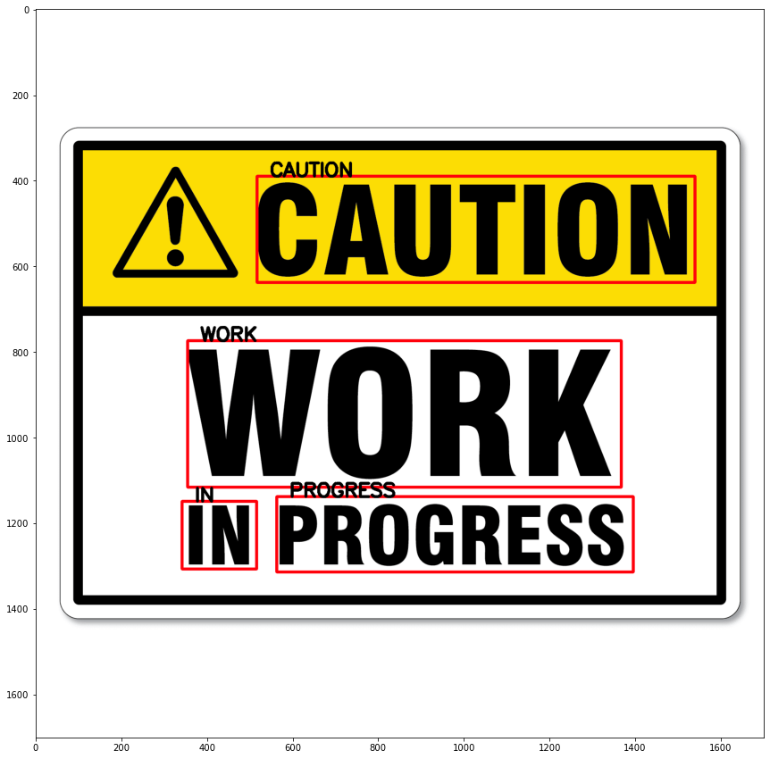

# Optical-Character-Recognition
# By DIPAN MANDAL
## So, What is Optical Character Recognition or, OCR ?
<b> Optical Character Recognition or Optical Character Reader is the electronic or mechanical conversion of images of typed, handwritten or printed text into machine-encoded text, whether from a scanned document, a photo of a document, a scene-photo or from subtitle text superimposed on an image. </b>

